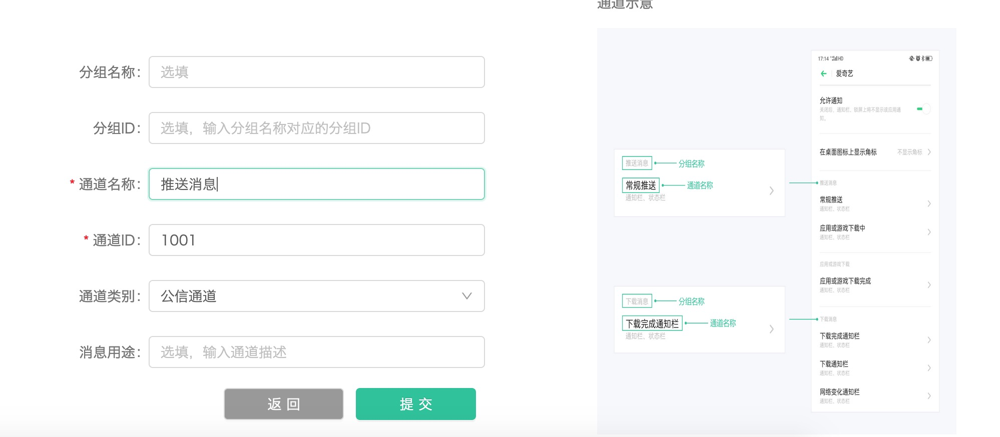
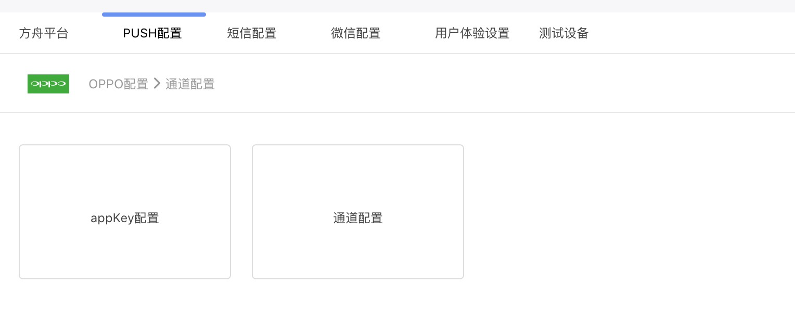
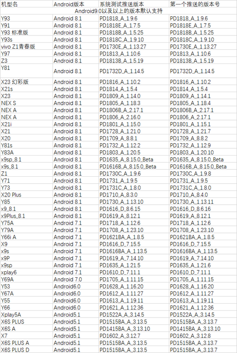

# Android SDK

## 一、SDK简介

易达系统是易观基于方舟平台一款触达用户的产品，加强产品的用户体验和提升产品的转化率，易达的 Android SDK 是此系统中重要的支撑点，提供以下功能：

*   触达用户的弹窗功能，支持弹窗样式：

    1. 图片样式，支持点击事件
    2. 文本样式，支持标题、正文、两个按钮。
    3. 图文混合样式，最上面是图片，下面是标题、正文、按钮
    4. 文字 + 视频样式，支持视频播放


*    banner 信息流广告，支持样式：

    1. 文字 + 大图片样式，支持点击事件
    2. 文字 + 小图片样式，支持点击事件
    3. 文字 + 多图片样式，支持点击事件
    4. 文字 + 视频样式，支持视频播放
    5. 轮播图样式，支持每张图片单独点击事件


* 订阅事件，用户在后台如果创建了基于用户事件的触发行为（弹窗除外），SDK 就会在每次启动的时候根据是否有事件更新来拉取订阅列表，并在有订阅事件产生的时候通知易达系统。

## 二、快速开始

为了快速的接入厂商推送通道，我们在EA pushSDK中集成了华为、小米、OPPO、VIOV、魅族厂商推送SDK。如果现在你的应用已经接入了某些厂商的通道，你需要把相关接入代码删除。

### 1、获取项目AppKey

  在EA系统中选择要集成的项目，并在项目属性中查看项目的appKey，[登录EA系统](https://ea.analysys.cn/app.html#/Login)

### 2、集成SDK

        在项目根目录的build.gradle中添加如下代码：

```
buildscript {
    repositories {
        ...
        maven { url 'http://maven.aliyun.com/nexus/content/groups/public/'}
        jcenter { url 'http://maven.aliyun.com/nexus/content/groups/public/' }
        maven { url 'http://developer.huawei.com/repo/' }
    }
    dependencies {
        ...
        classpath 'com.huawei.agconnect:agcp:1.0.0.300'
    }
}
allprojects {
    repositories {
        ...
        //EA SDK的maven地址
        maven { url 'http://maven.aliyun.com/nexus/content/groups/public/'}
        jcenter { url 'http://maven.aliyun.com/nexus/content/groups/public/' }
        maven { url "http://developer.huawei.com/repo/" }
        maven { url "https://jitpack.io" }
    }
}
```

* 集成SDK

        在app的Module的build.gradle中添加如下引用：

```
dependencies {
//集成方舟SDK
implementation 'cn.com.analysys:analysys-arkanalysys:4.5.13'
//EA push SDK集成了华为、小米、OPPO、VIVO、魅族推送SDK
//如果已经集成了厂商的SDK，可以不集成analysys-easytouch-push,将厂商的token通过pushToken接口上报
implementation 'cn.com.analysys:analysys-easytouch-push:0.3.3'
//EA SDK
implementation 'cn.com.analysys:analysys-easytouch:2.2.5'
}
```

* 添加厂商推送依赖

        在应用的Module的build.gradle中添加如下引用(集成analysys-easytouch-push的时候需要如下配置，反之不需要配置)：

```
    defaultConfig {
        ...
        manifestPlaceholders = [
        //如果开通了就输入相关的配置，如果没有开通的请设置""
                EA_PUSH_PARAM_XIAOMI_APPID:"小米推送的appID",
                EA_PUSH_PARAM_XIAOMI_APPKEY:"小米推送的appKey",
                EA_PUSH_PARAM_OPPO_APPKEY:"OPPO推送的appKey",
                EA_PUSH_PARAM_OPPO_APPSECRET:"OPPO推送的appSecret",
                EA_PUSH_PARAM_VIVO_APPID:"VIVO推送的appID",
                EA_PUSH_PARAM_VIVO_APPKEY:"VIVO推送的appKey",
                EA_PUSH_PARAM_MEIZU_APPID:"魅族的appID",
                EA_PUSH_PARAM_MEIZU_APPKEY:"魅族的appKey",
                EA_PUSH_PARAM_HUAWEI_APPID:""
        ]
    }
```

并在build.gradle文件头添加如下配置：

```
apply plugin: 'com.huawei.agconnect'
```

### 3、初始化EA SDK接口

```
AnalysysEaConfig builder = new AnalysysEaConfig();
//填写自己申请的AppKey
builder.setAppKey("*******");
//设置APP的首页地址；包括包名的完整的路径.
//例如:com.aneesoft.ygqf.common.MainActivity
builder.setMainPage("*******");
//私有化部署的情况下，设置EA服务的地址URL
//builder.setUrl("*******");
//数据上报url
builder.setUploadURL("*******");
AnalysysEaManager.init(getApplicationContext(), builder);
//推送厂商的token上报SDK
AnalysysEaPushManager.getInstance().init(getApplicationContext());
```

### 4、上报相关用户属性

通过方舟SDK上报如下的用户属性可以方便APP触达到用户

```
上报pushToken(非厂商推送需要上报)：
   AnalysysEaManager.pushToken(AnalysysEaConfig.pushTokenType.JPUSH, token);
上报用户手机号：
   AnalysysAgent.profileSet(context, "$PHONE", phone);
上报用户邮箱：
   AnalysysAgent.profileSet(context, "$EMAIL", email);
上报微信OPENID：
   AnalysysAgent.profileSet(context, "$WECHATOPENID", openid);
```

### 5、添加混淆设置

如果APP在打包的时候开启了混淆，请在proguard-rules.pro中添加如下设置

```
-keep class com.analysys.** {*;}
-keep class * extends com.raizlabs.android.dbflow.config.DatabaseHolder { *; }
-keep class com.flyco.** {*;}
```

## 三、推送功能集成

### 1、华为推送

* 配置文件集成：

 针对AndroidStudio开发环境，华为提供了maven仓集成方式的HMS SDK包。在开始开发前，您需要将HMS SDK集成到您的AndroidStudio开发环境中。 在AndroidStudio开发环境中添加当前应用的AppGallery Connect配置文件。 

       a.登录 [AppGallery Connect 网站](https://developer.huawei.com/consumer/cn/service/josp/agc/index.html)，选择“我的项目”。

        b.在项目列表中找到您的项目。

        c.单击“应用”栏下的“agconnect-services.json”下载配置文件。

        d.将agconnect-services.json文件拷贝到应用级根目录下。

* 添加SHA256证书指纹

MAC平台：

用winrar打开待查看的apk，将其中META-INF文件夹解压出来，得到其中的CERT.RSA文件，通过：keytool -printcert -file META-INF/CERT.RSA 

注意：debug安装包和release安装的证书是不同的；

* 支持APP内页面跳转

         在AndroidManifest.xml中的页面注册中添加如下设置：

```
<intent-filter>
    <action android:name="activity全名" />
    <category android:name="android.intent.category.DEFAULT" />
    <category android:name="android.intent.category.BROWSABLE"/>
</intent-filter>
```

* 配置回执接口

请按照华为推送配置做相应的回调设置，这样可以便于系统统计推送的结果。链接如下： [华为配置推送服务参数](https://developer.huawei.com/consumer/cn/service/hms/catalog/AGCHelp.html?page=AGC_appGalleryConnect_associated_service#openSwitch)

回执地址：[https://ea.analysys.cn:8088/push/callback/huawei](http://ea.analysys.cn:9999/push/callback/huawei)

证书配置：

```
-----BEGIN CERTIFICATE-----
MIIFzzCCBLegAwIBAgIMZK2Csd1qW7ekZNWxMA0GCSqGSIb3DQEBCwUAMFMxCzAJ
BgNVBAYTAkJFMRkwFwYDVQQKExBHbG9iYWxTaWduIG52LXNhMSkwJwYDVQQDEyBH
bG9iYWxTaWduIEdDQyBSMyBEViBUTFMgQ0EgMjAyMDAeFw0yMDExMDUwOTQ3NTla
Fw0yMTEyMDcwOTQ3NTlaMBgxFjAUBgNVBAMMDSouYW5hbHlzeXMuY24wggEiMA0G
CSqGSIb3DQEBAQUAA4IBDwAwggEKAoIBAQC+os27gaoJpRoSP0086NLVn6vuYOUe
D7Kyf+PXHhE0o7V9/QhmKlI+Qey7kLW98nQ8uNPdK7QFCCzWFdglKufcYuCavi1e
+9tj25bHwDR4RmA8M4ugxeesD531Zel9/zSFB3U9a18hBPg7PwX4iM1hK9bhMi3E
gJLYt/USoE5RwS9X8jhJjXhzxe0/kCHfFTGhGjw0fcKQCb6T+mCccfw3hphYzsle
McV4fz2pL7b7HROA1ZwZNGs6xm67Fx/EUkHckcf/sPgwjLP67ByJa1Kor2GqOLST
9TLJXiH8qm5QsbNgVg6BLg4xNfVFNk7Kvl/ewJF0wiyw0j6YsiuuSexdAgMBAAGj
ggLcMIIC2DAOBgNVHQ8BAf8EBAMCBaAwgZMGCCsGAQUFBwEBBIGGMIGDMEYGCCsG
AQUFBzAChjpodHRwOi8vc2VjdXJlLmdsb2JhbHNpZ24uY29tL2NhY2VydC9nc2dj
Y3IzZHZ0bHNjYTIwMjAuY3J0MDkGCCsGAQUFBzABhi1odHRwOi8vb2NzcC5nbG9i
YWxzaWduLmNvbS9nc2djY3IzZHZ0bHNjYTIwMjAwVgYDVR0gBE8wTTBBBgkrBgEE
AaAyAQowNDAyBggrBgEFBQcCARYmaHR0cHM6Ly93d3cuZ2xvYmFsc2lnbi5jb20v
cmVwb3NpdG9yeS8wCAYGZ4EMAQIBMAkGA1UdEwQCMAAwQQYDVR0fBDowODA2oDSg
MoYwaHR0cDovL2NybC5nbG9iYWxzaWduLmNvbS9nc2djY3IzZHZ0bHNjYTIwMjAu
Y3JsMCUGA1UdEQQeMByCDSouYW5hbHlzeXMuY26CC2FuYWx5c3lzLmNuMB0GA1Ud
JQQWMBQGCCsGAQUFBwMBBggrBgEFBQcDAjAfBgNVHSMEGDAWgBQNmMBzf6u9vdlH
S0mtCkoMrD7HfDAdBgNVHQ4EFgQU9xICOoLVlfm8fWslRTV2sdHYq+YwggECBgor
BgEEAdZ5AgQCBIHzBIHwAO4AdQBvU3asMfAxGdiZAKRRFf93FRwR2QLBACkGjbII
mjfZEwAAAXWXzlWaAAAEAwBGMEQCIEkK4HHVFoe5mK0qGO/2vtyM3vKxXv0YIx9B
ky8XRnvqAiBdNjJBhqjmj4tz4sxdWxS+DAccvoVWTDu/YlG6qnj45wB1APZclC/R
dzAiFFQYCDCUVo7jTRMZM7/fDC8gC8xO8WTjAAABdZfOWEQAAAQDAEYwRAIgR3ux
f+wCKvwi86pAtozvZ+U9fs4Tlh0zYRccG+llDBACICJMilJYHJ9XacrCK4iO+280
ryDD5udmUA5KEh6GANOcMA0GCSqGSIb3DQEBCwUAA4IBAQANkQWk/fGPY6QGRhjB
56SC1ypXVyjoPBf4ol/PJ+YD1q665+fL5aMjSiewVEDKXrWVGd90YHI1u7vJAJMh
/97fz3CpnisajXAqDgWooDnRN1KvpAQjH2V+NbTf87iCPSjX9tf6swoEVonYliOT
hEpNe4RuTEGdpo9lcPm/QY6wFcnjSIbeDwQ8AAWaco5uvbJyxfeORsgpg76Ww6kq
xBXBs71YZWFVCD7F7HLraiIMObGkepjPhsG4bheSf9KJtJzcA+rApP6ZrDB5o03e
ypdP9fH3mvV5ijyugRdFWa6C/1NILKgqrUwvwppxTTXGduhuE5mJOeuken5cNJku
zOb5
-----END CERTIFICATE-----
```

### 2、魅族推送

* 配置回执接口

请在魅族的推送后台配置回执接口，魅族地址如下：[http://push.meizu.com/#/config/callback?appId=16395&\_k=k2zwxs](http://push.meizu.com/#/config/callback?appId=16395&\_k=k2zwxs)

回执地址：[http://ea.analysys.cn:9999/push/callback/meizu](http://ea.analysys.cn:9999/push/callback/meizu)

### 3、OPPO推送

android 8以上版本需要配置通道：

* [登录OPPO推送平台](https://push.oppo.com/top/application-list)
* 左侧边栏选配置管理下的新建通道，如下图：


* 在右侧编辑通道信息并提交，如下图：



通道ID(1001)，是EA默认的通道；

如果已经在OPPO创建过通道，可以在EA的后台的系统设置中配置相关通道信息。如下图：



在application的派生类中注册通道信息，代码如下（如果使用默认通道，就不需要注册了）：

```
    private void createNotifyChannel() {
        NotificationManager mNotificationManager = (NotificationManager) getSystemService(Context.NOTIFICATION_SERVICE);
        if (null == mNotificationManager) {
            return;
        }
        if (Build.VERSION.SDK_INT >= Build.VERSION_CODES.O) {
            NotificationChannel channel = new NotificationChannel("1001",
                    getResources().getString(R.string.app_name), NotificationManager.IMPORTANCE_HIGH);
            //是否在桌面icon右上角展示小红点
            channel.enableLights(true);
            //小红点颜色
            channel.setLightColor(Color.RED);
            //是否在久按桌面图标时显示此渠道的通知
            channel.setShowBadge(true);
            mNotificationManager.createNotificationChannel(channel);
        }
    }
```

### 4、验证推送注册结果

在logcat中过滤日志：

```
registerPush
```

查看相关日志，看厂商推送注册失败返回的错误码，并将相关信息提供给EA开发者进行分析。

### 5、厂商推送支持的版本说明

华为推送：

EMUI 10.0.0以上或者推送服务App版本为9.1.1.401以上，HMS core版本在4.0.3.316以上

小米推送：

Android支持4.0以上版本；并需要**MIUI7**以上版本支持；

OPPO推送：

目前支持ColorOS3.1及以上的系统。目前只支持通知栏消息。

在Android 8.0 及后续机型上指定通道进行推送，EA的默认通道是1001。

VIVO推送：

SDK仅支持下表中的机型和对应的系统及以上系统:



魅族推送：

Flyme系统（4.0，4.5，5）上

## 四、SDK接口

### 1、SDK初始化接口

接口定义：

```
void init(Context context, AnalysysEaConfig config)；
```

参数说明：

| 参数      | 说明     | 必填 | 备注       |
| ------- | ------ | -- | -------- |
| context | 应用的上下文 | 是  | 不可为空     |
| config  | 环境参数   | 是  | config说明 |

返回值：无

注意事项：无

### 2、获取事件通知接口

接口定义：

```
public ObserverListener getObserverListener()
```

参数说明：无

返回值： ObserverListener 返回监听的 接口，需要设置到方舟SDK中。

注意事项：

### 3、上报推送token

接口定义：

```
    /**
     * 上报推送token
     *
     * @param type  token的推送类型
     * @param token token值
     */
    public void pushToken(AnalysysEaConfig.pushTokenType type, String token)
```

参数说明：

| 参数    | 说明      | 必填 | 备注 |
| ----- | ------- | -- | -- |
| type  | 推送的类型   | 是  |    |
| token | 推送token | 是  |    |

### 4、上报push事件

接口定义：

```
public void pushTrack(AnalysysEaConfig.PushEventType type, final HashMap<String, Object> msg)
```

参数说明：

| 参数   |      说明     | 必填 | 备注       |
| ---- | :---------: | -- | -------- |
| type |  push的事件类型  | 是  | 不可为空     |
| msg  | push事件的属性信息 | 是  | push属性说明 |

返回值：无

注意事项：

接口是为了统计push的到达、点击的事件，此接口在以下场景中需要调用：

* 华为的通知栏点击事件
* VIVO的通知栏点击事件
* OPPO的通知栏点击事件
* 第三方的PUSH到达、点击的事件

### 5、设置页面别名

接口定义：

```
//此接口是为了便于运营在EA的后台方便选中页面信息
public void setPageTagState(boolean state)
```

参数说明：

|   参数  |             说明             | 必填 | 备注 |
| :---: | :------------------------: | -- | -- |
| state | 设置别名的开关状态,true是打开；false是关闭 | 是  |    |

返回值：无

### 6、设置是否显示对话框

接口定义：

```
//此接口用于全局控制对话框的展示
public void setDialogVisible(boolean visible)
```

参数说明：

|    参数   |              说明             | 必填 | 备注      |
| :-----: | :-------------------------: | -- | ------- |
| visible | 是否显示对话框,true是显示；false是不显示关闭 | 否  | 默认为true |

返回值：无

### 7、上传公众号的ID

接口定义：

```
//此接口用于全局控制对话框的展示
public void setWeChatId(String unionId, String appId, String openId)
```

参数说明：

|    参数   |       说明      | 必填 | 备注 |
| :-----: | :-----------: | -- | -- |
| unionId |   企业unionID   | 否  |    |
|  appId  | 小程序、公众号的appID | 是  |    |
|  openId |    用户openId   | 是  |    |

返回值：无

### 8、加载信息流

接口定义：

```
/**
 * 加载banner
 *
 * @param config banner配置
 * @param layout 布局的ID
 */
public void loadBanner(AnalysysBannerConfig config, FrameLayout layout)
```

参数说明：

| 参数     | 说明       | 必填 | 备注 |
| ------ | -------- | -- | -- |
| config | 信息流的配置信息 | 是  |    |
| layout | 信息流的展示位置 | 是  |    |

返回值：无

备注：FAQ中的**信息流的集成流程**

### 9、释放接口

接口定义：

```
public void release()
```

参数说明：无

返回值：无

## 五、备注

### 1、EaConfigBuilder说明

```
public class AnalysysEaConfig {
    private String appKey;
    private EnvType envType;
    private String mainPage = "";
    private String url = "";
    
    public enum EnvType {
        /**
         * 开发环境
         */
        ENV_DEV,
        /**
         * 测试环境
         */
        ENV_TEST,
        /**
         * 生产环境
         */
        ENV_ONLINE
    }

    public AnalysysEaConfig() {
    }

    /**
     * 设置系统的appKey
     *
     * @param appKey
     */

    public void setAppKey(String appKey) {
        this.appKey = appKey;
    }

    /**
     * 设置环境信息
     *
     * @param envType
     */
    public void setEnvType(EnvType envType) {
        this.envType = envType;
    }
    /**
     * 设置日志级别 NONE 是无日志
     *
     * @param logLevelType
     */
    public void setLogLevelType(LogLevel logLevelType) {
        this.LogLevelType = logLevelType;
    }
    
    /**
     * 设置应用中的主页，对应活动中的立即弹窗功能；
     *
     * @param mainPage 主页的完整的url地址,包括包名的;
     */
    public void setMainPage(String mainPage) {
        this.mainPage = mainPage;
    }

    /**
     * 设置EA服务的地址URL；
     *
     * @param url 主页的url地址;
     */
    public void setUrl(String url) {
        this.url = url;
    }
}
```

### 2、push属性说明

$push_channel 活动的渠道信息

activityId 活动信息

代码如下所示：

```
    public static void pushTrack(Intent intent) {
        if (intent == null) return;
        Bundle bundle = intent.getExtras();
        if (bundle != null) {
            Set<String> set = bundle.keySet();
            HashMap<String, Object> hm = new HashMap<>();
            if (set != null) {
                for (String key : set) {
                    if (key.equals("activityId") || key.equals("$push_channel")) {
                        hm.put(key, bundle.getString(key));
                    }
                }
                if (hm.containsKey("activityId") && hm.containsKey("$push_channel")) {
                    AnalysysEaManager.pushTrack(AnalysysEaConfig.PushEventType.PUSH_CLICK, hm);
                }
            }
            Log.e("BaseActivity", "json：" + hm.toString());
        }
    }
```

调用示例：

```
public class BaseActivity extends AppCompatActivity {
    @Override
    protected void onCreate(Bundle savedInstanceState) {
        super.onCreate(savedInstanceState);
        pushTrack(getIntent());
    }

    @Override
    protected void onNewIntent(Intent intent) {
        super.onNewIntent(intent);
        pushTrack(intent);
    }
}
```

## 六、FAQ

### 1、OPPO、vivo、魅族推送发送失败的排查方式：

1、先排查是否在EA系统中配置的推送的信息；

### 2、如何开通小米的锁屏通知

小米手机安装APP后默认是开启通知栏PUSH功能，但是锁屏通知需要在通知管理中开启。

### 3、华为推送通知栏功能

华为通知栏消息的样式只能是系统默认样式，通知栏消息的声音、样式和振动等不可以自定义。 [https://developer.huawei.com/consumer/cn/doc/help/100602](https://developer.huawei.com/consumer/cn/doc/help/100602)

### 4、VIVO推送通知栏功能

VIVO的状态栏通知默认是关闭的。需要提示用户打开通知栏。

### 5、华为推送集成报错：907135003: client api invalid

在应用市场搜索：HMS Core、推送服务，更新到最新版本；并在设置—应用—应用管理—搜索HMS Core 和推送服务，清理缓存。

关于token，如果是emui10及以上是getToken直接返回，对于emui10以下则在onNewToken返回token

### 6、华为推送打开APP内页面

在发送推送后，当用户点击通知栏后跳转到APP内的页面，需要把页面在AndroidManifest中添加action定义，如下所示：

```
        <activity
            android:name=".personcenter.message.MessageView"
            android:screenOrientation="portrait" >
            <intent-filter>
                <action android:name="activity全名" />
                <category android:name="android.intent.category.DEFAULT" />
                <category android:name="android.intent.category.BROWSABLE"/>
            </intent-filter>
        </activity>
```

### 7、小米推送获取KV

```
        if (DeviceUtil.isXiaomiDevice()) {
            MiPushMessageParser parser = new MiPushMessageParser();
            if (parser.parserMessage(intent)) {
                Map<String, String> message = parser.getExtra();
                for (String key : message.keySet()) {
                    Log.i("BaseActivity", "key = " + key + "; value = " + message.get(key));
                }
            }
        }
```

### 8、华为接入Cordova框架的方式

地址：[https://developer.huawei.com/consumer/en/doc/development/HMS-Plugin-Guides/push-integrating-cordova-sdk-0000001050135717](https://developer.huawei.com/consumer/en/doc/development/HMS-Plugin-Guides/push-integrating-cordova-sdk-0000001050135717)

### 9、信息流的集成流程

1、登录EA系统，点击右上角设置按钮，进入banner配置，然后添加位置信息；创建成功后会生成一个位置ID，这个位置ID就是APP端要使用。

2、在集成SDK后，在需要展示的信息流的位置添加如下布局

```
    <FrameLayout
        android:id="@+id/banner_container"
        android:layout_width="match_parent"
        android:layout_height="match_parent"
        android:layout_centerInParent="true" />
```

3、在相应的类中添加如下代码：

```
FrameLayout bannerCainer = view.findViewById(R.id.banner_container);
AnalysysBannerConfig config = new AnalysysBannerConfig.Builder().setLocationID("EA系统中位置ID").build();
AnalysysEaManager.loadBanner(config, bannerCainer);
```

